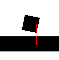
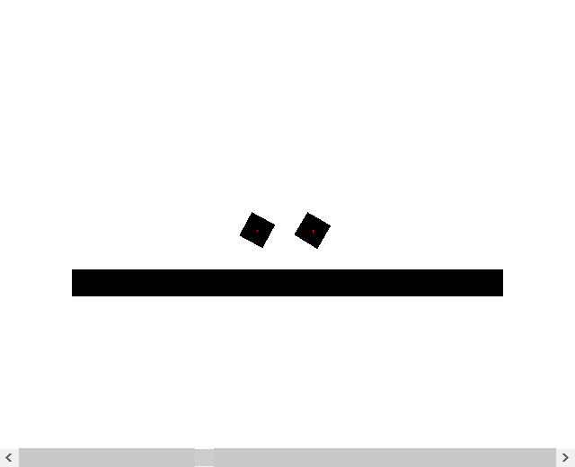

# fysik2d #
fysik2d is a set of classes thats implements a high accuracy 2D rigid body physics system. The goal is to be fast and easy to use and extend. By limiting the computations to only two dimensions simplicity is increased.

Asserted forces visualized in the AWT demo applet.

Simple demo applet.

